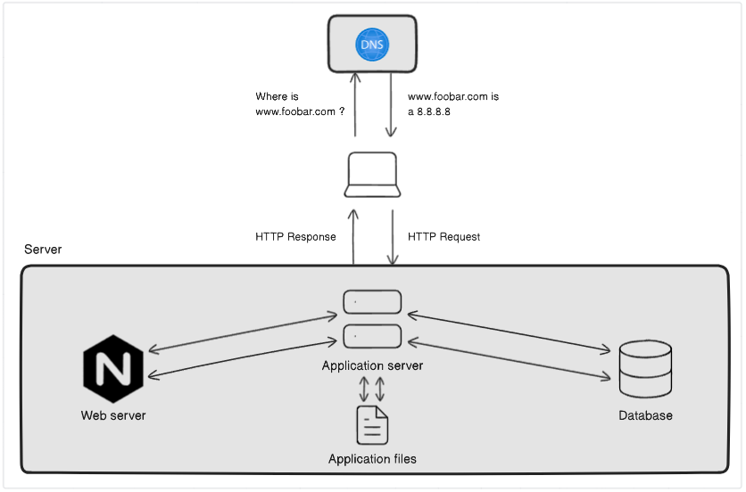

# Simple Web Stack

## Description

This a one server web infrastructure that hosts the website that is reachable via www.foobar.com.

## Specifics About This Infrastructure

- <b>Server:</b> The server is a physical computer that hosts the website's files and applications. It also communicates with the user's computer to deliver the website's content.

- <b>Domain name:</b> The domain name is the human-readable address of the website. In this case, the domain name is www.foobar.com.

- <b>DNS record:</b> A DNS record is a mapping of a domain name to an IP address. In this case, the DNS record for www.foobar.com points to the IP address of the server.

- <b>Web server:</b> The web server is responsible for receiving and responding to HTTP requests from the user's browser. It delivers the website's static content, such as HTML pages and images.

- <b>Application server:</b> The application server is responsible for processing dynamic content, such as PHP scripts. It also interacts with the database to retrieve and store data.

- <b>Database:</b> The database stores the website's data, such as user accounts, products, and orders.

- <b>IP address:</b> The IP address is a unique identifier for a computer on the internet. The server's IP address is 8.8.8.8.

- The server communicates with the user's computer using the Internet Protocol (IP). IP is the underlying protocol that allows computers to communicate over the internet.

## The issues with this infrastructure are:

- Single point of failure (SPOF): If the server fails, the website will be unavailable.
- Downtime when maintenance is needed: If the server needs to be updated or patched, it will need to be taken offline, which will cause the website to be unavailable.
- Cannot scale if too much incoming traffic: If the website receives too much traffic, the server may not be able to handle it and the website will become slow or unavailable.
