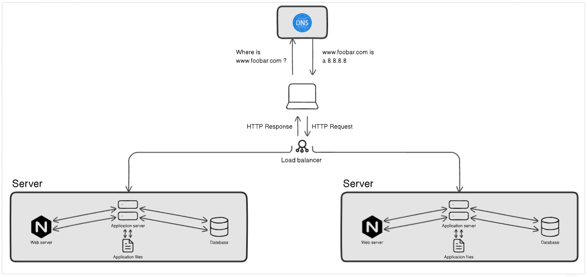

## Distributed Web Infrastructure

## Description

This is a distributed web infrastructure that tries to lower the traffic to the primary server by sharing some of the work with a replica server with the help of a server that balances the work between the two servers (primary and replica).

## Specifics About This Infrastructure

- The load balancer is added to distribute traffic across the two web servers. This helps to improve performance and reliability. The load balancer is configured with a round robin distribution algorithm, which means that it distributes requests evenly between the two web servers.

- The load balancer is also configured in an active-active setup. This means that both web servers are running and responding to requests simultaneously. If one web server fails, the other web server will continue to handle requests.

- The database is configured as a primary-replica cluster. This means that there is one primary node and one replica node. The primary node is the main database server and it is responsible for all writes. The replica node is a copy of the primary node and it is responsible for reads.

- The difference between the primary node and the replica node in regard to the application is that the primary node is the only node that can be written to. The replica node can only be read from.

## The issues with this infrastructure are:

- <b>Single point of failure (SPOF):</b> The load balancer is a single point of failure. If the load balancer fails, all traffic will be directed to one of the web servers, which could overload the web server and cause it to fail.
- <b>Security issues:</b> There is no firewall, so the infrastructure is exposed to attacks from the internet. There is also no HTTPS, so all traffic is sent over the internet unencrypted.
- <b>No monitoring:</b> There is no monitoring in place, so there is no way to know if the infrastructure is working properly or if there are any problems.
