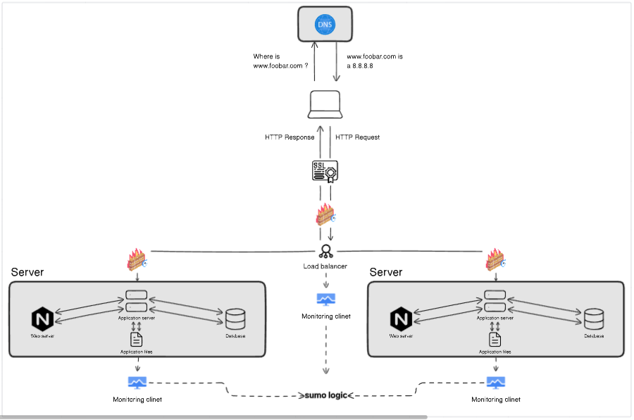

## Secured and Monitored Web Infrastructure

## Description

This is a secured and monitored web infrastructure with three servers that is protected, watched, and delivers encrypted data.

## Specifics About This Infrastructure

- The firewalls are added to protect the infrastructure from attacks from the internet. The first firewall is located in front of the DNS server to protect the DNS server from attacks. The second firewall is located in front of the load balancer to protect the load balancer from attacks. The third firewall is located in front of the database server to protect the database server from attacks.

- The SSL certificate is used to encrypt all traffic between the user's browser and the load balancer. This helps to protect the user's data from being intercepted by third parties.

- The monitoring clients are used to collect data about the health and performance of the infrastructure. This data can be used to identify and troubleshoot problems before they impact the users.

- The monitoring tool is collecting data from the monitoring clients using a variety of methods, such as SNMP, SSH, and HTTP. The data is then stored in a central repository, such as a cloud-based monitoring system, where it can be analyzed and visualized.

- To monitor your web server QPS, you can use a monitoring tool that supports this metric. The monitoring tool will collect data about the number of requests that are being processed by the web server per second. This data can then be used to track the performance of the web server and identify any bottlenecks.

## Issues With This Infrastructure

- Terminating SSL at the load balancer level is an issue because it means that all traffic is unencrypted between the load balancer and the web servers. This could allow an attacker to intercept the traffic and steal sensitive data.

- Having only one MySQL server capable of accepting writes is an issue because if the server fails, there will be no way to write data to the database.

- Having servers with all the same components (database, web server and application server) might be a problem because if one server fails, all of the components will be unavailable.
