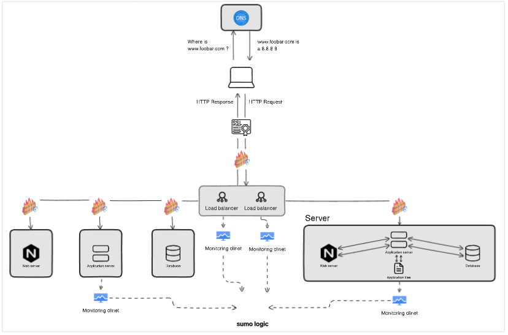

## Scale up

## Description

This web infrastructure is an improved version of the system described [here](2-secured_and_monitored_web_infrastructure.md). In this version, all single points of failure have been eliminated and each of the main components (web server, application server, and database servers) have been separated into different servers. The SSL security is not stopped at the load-balancer and each server’s network is secured with a firewall and they are also monitored.

## Specifics About This Infrastructure

- The second load balancer is added to provide redundancy. This means that if one load balancer fails, the other load balancer will continue to handle traffic.

- The load balancers are configured as a cluster. This means that they are working together to distribute traffic. This helps to improve the performance and reliability of the infrastructure.

- The web server, application server, and database are split onto different servers to improve fault tolerance. This means that if one server fails, the other servers will continue to operate.
